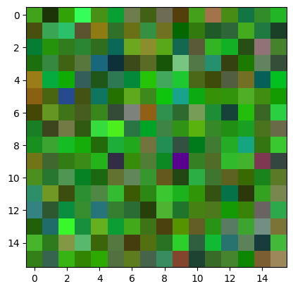

# Genetic-Algorithm
In this project, I've leveraged Python to implement a Genetic Algorithm, a powerful optimization technique inspired by the process of natural selection. What sets this implementation apart is its application to 2-dimensional RGB images, offering a fascinating visualization of the evolutionary process. Explore how these algorithms iteratively generate and refine images, mirroring nature's own mechanisms for adaptation and improvement.

## Final Generation

Caption: The final generation of images produced by the genetic algorithm, showcasing the culmination of the evolutionary process.

